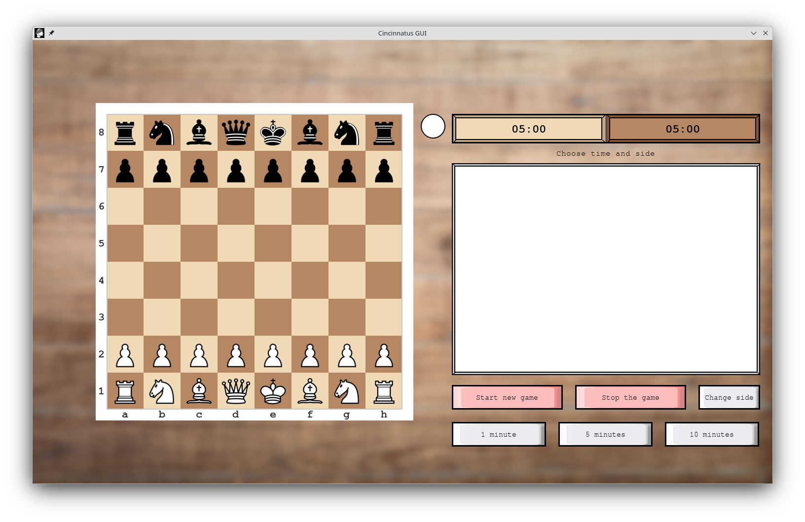

# Cincinnatus GUI

This is graphical user interface for the **Cincinnatus chess engine**. This tool provides a streamlined, user-friendly layer to interact with the engine's core capabilities using a native Python-based interface.
---

## Configuration & Setup

Follow these steps to set up a local development environment. Using a virtual environment ensures that dependencies are isolated and won't interfere with your system Python.

First clone the repo
```bash
git clone https://github.com/boce1/pyuci-chessgui.git
cd pyuci-chessgui
```

### Windows
1. Create virtual environment:
```bash
python -m venv venv
```
2. Activate the virtual environment:
```bash
.\venv\Scripts\activate
```
3. Install the required packages:
```bash
pip install -r requirements.txt
```
4. Launch the application:
```bash
python main.py
```

### Linux
1. Create virtual environment:
```bash
python3 -m venv venv
```
2. Activate the virtual environment:
```bash
source venv/bin/activate
```
3. Install the required packages:
```bash
pip install -r requirements.txt
```
4. Launch the application:
```bash
python3 main.py
```

## The Cincinnatus engine
The binaries are included in `engines` directory. There are executables for `Windows` and `Linux`.

This chess gui is cross-platform compatible.

The source code of the engine: https://github.com/boce1/cincinnatus.git

### Refrences

## References

- **Application Icon:** "Caesar icon" by [Delapouite](https://game-icons.net/1x1/delapouite/caesar.html) is licensed under [CC BY 3.0](https://creativecommons.org/licenses/by/3.0/).
- **Chess Piece Icons:** PNGs provided by [Green Chess](https://greenchess.net/info.php?item=downloads) are licensed under [CC BY-SA](https://creativecommons.org/licenses/by-sa/3.0/).
- **Sound effects:** From [Lichess](https://github.com/lichess-org/lila/tree/master/public/sound) (Licensed under [AGPL-3.0]


# Executables

The engine and the GUI are Windows and Linux compatable. 

You can find the latest compiled binaries (EXE) and the source code in the [Releases](https://github.com/boce1/pyuci-chessgui/releases/tag/v1.0) section.

# The GUI


This GUI communicate with the chess engine with UCI protocol. It sends UCI command, the engine calculates the tree of game states and give the best move. Engine also gives useful information about search like Principal Variation table at the current depth, evalauated score for the board and the depth of the search. At the beggining of the game depth is ussually 8 to 10, at the eng game can go to 30.

Modern chess GUIs can modify the time for the game, moves to go and increment seconds for move. The idea for this gui is not to test other engines and do tournaments with them but to demonstrate how Cincinnatus work.

User can choose between 1, 5 and 10 minutes game. User can change sides. It's important to point that the time and side can be change when game isn't in progress. 

- For 1 minute game GUI tells the Cincinnatus engine to calculate moves for game where there will be played 80 moves and it takes about the 1 second to make a move.
- For 5 minutes game GUI tells the Cincinnatus engine to calculate moves for game where there will be played 60 moves and it takes about the 5 seconds to make a move.
- For 10 minutes game GUI tells the Cincinnatus engine to calculate moves for game where there will be played 60 moves and it takes about the 10 seconds to make a move.